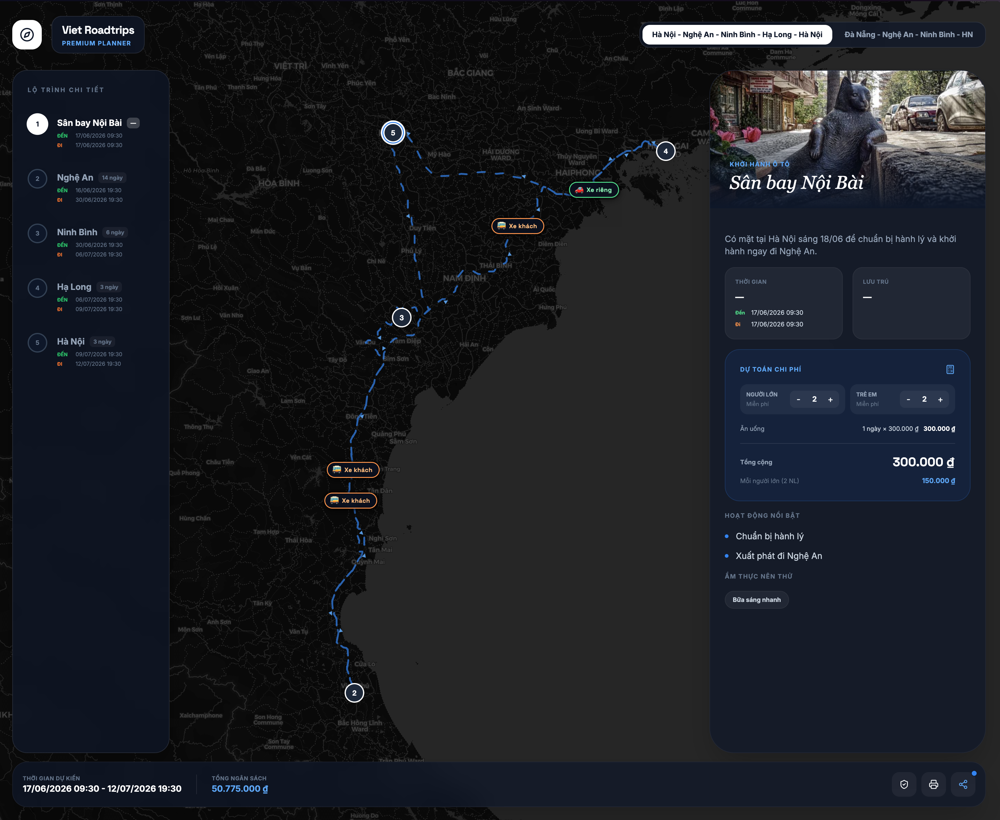
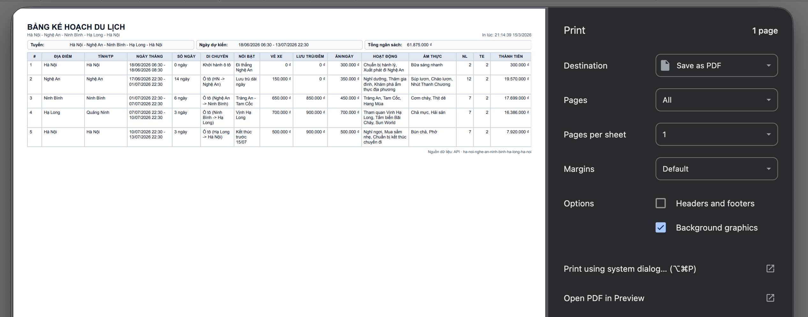

# Vietnam Roadtrips — Visual travel planner powered by AI

> Chat with your AI. Get a shareable link. No login. No friction.

**[trips.naai.studio](https://trips.naai.studio)**

---

## The idea

Western travel culture loves roadtrips — hopping between towns, experiencing local food, sleeping somewhere new every night. Vietnam is *perfect* for this: the country stretches 1,650 km from north to south, packed with distinct provinces, each with its own cuisine, landscapes, and rhythm.

Most AIs can plan a great multi-stop Vietnam itinerary — but the output is a wall of text. **Vietnam Roadtrips** gives that plan a visual home: an interactive timeline with a live map, estimated time at each attraction, transport between stops, food recommendations, and cost estimates. All rendered beautifully from a single shareable link.





---

## Quick start — Add the MCP to your AI

No installation needed. Connect your AI directly to the server:

```
https://trips.naai.studio/mcp
```

Pick your AI client below:

<details>
<summary><strong>Claude Desktop</strong></summary>

Edit `~/Library/Application Support/Claude/claude_desktop_config.json`:

```json
{
  "mcpServers": {
    "vietnam-roadtrips": {
      "url": "https://trips.naai.studio/mcp"
    }
  }
}
```

Restart Claude Desktop.

</details>

<details>
<summary><strong>Claude Code</strong></summary>

Run in terminal:

```bash
claude mcp add vietnam-roadtrips --transport http https://trips.naai.studio/mcp
```

Or add manually to `~/.claude/claude_desktop_config.json` (same JSON as Claude Desktop above).

</details>

<details>
<summary><strong>Cursor</strong></summary>

Edit `~/.cursor/mcp.json`:

```json
{
  "mcpServers": {
    "vietnam-roadtrips": {
      "url": "https://trips.naai.studio/mcp"
    }
  }
}
```

</details>

<details>
<summary><strong>Windsurf</strong></summary>

Edit `~/.codeium/windsurf/mcp_config.json`:

```json
{
  "mcpServers": {
    "vietnam-roadtrips": {
      "url": "https://trips.naai.studio/mcp"
    }
  }
}
```

</details>

<details>
<summary><strong>Gemini CLI</strong></summary>

Edit `~/.gemini/settings.json`:

```json
{
  "mcpServers": {
    "vietnam-roadtrips": {
      "url": "https://trips.naai.studio/mcp"
    }
  }
}
```

</details>

<details>
<summary><strong>Antigravity</strong></summary>

Add in the MCP settings panel:

```json
{
  "mcpServers": {
    "vietnam-roadtrips": {
      "url": "https://trips.naai.studio/mcp"
    }
  }
}
```

</details>

<details>
<summary><strong>OpenAI Codex CLI</strong></summary>

Edit `~/.codex/config.toml`:

```toml
[mcp_servers.vietnam-roadtrips]
url = "https://trips.naai.studio/mcp"
```

</details>

<details>
<summary><strong>Zed</strong></summary>

Open **Settings → context_servers** and add:

```json
{
  "context_servers": {
    "vietnam-roadtrips": {
      "source": "custom",
      "command": {
        "path": "npx",
        "args": ["-y", "@modelcontextprotocol/inspector", "https://trips.naai.studio/mcp"]
      }
    }
  }
}
```

> Zed doesn't natively support HTTP MCP yet. The workaround above uses the MCP inspector as a bridge. Check [Zed's MCP docs](https://zed.dev/docs/mcp) for updates.

</details>

<details>
<summary><strong>Continue.dev</strong></summary>

Create `.continue/mcpServers/vietnam-roadtrips.yaml`:

```yaml
name: vietnam-roadtrips
url: https://trips.naai.studio/mcp
```

</details>

---

## Try it

Once connected, paste this into your AI:

```
Plan a 7-day Vietnam roadtrip from Hanoi heading south: Ninh Binh (2 nights),
Phong Nha (2 nights), Hue (1 night), Da Nang (2 nights). Group of 2 adults.
End of April 2026.

For each stop: add the top 3–4 attractions with estimated visit duration and
ticket prices, local food specialties, rough accommodation budget per night,
and transport from the previous stop (bus/train, estimated fare and travel time).

Use slug "hanoi-south-apr26" and push everything to Vietnam Roadtrips.
Return the share link when done.
```

Your AI will return something like:

```
Here's your trip: https://trips.naai.studio/?session=a3f8c2e1d4b7
```

Open it. Share it. Done.

### Continue editing later

The share link is the edit handle for AI workflows. If you want to continue
editing an existing AI-created trip in a later chat, give the AI the original
share link:

```
Continue editing this Vietnam Roadtrips plan:
https://trips.naai.studio/?session=a3f8c2e1d4b7

Add one extra night in Da Lat and update the cost estimates.
```

All edit tools accept either `shareUrl`, `sessionId`, or `planSlug`. For public
editing, prefer `shareUrl` because it points to the exact session plan.

---

## What the app shows

Each stop on your itinerary gets its own card on a vertical timeline, connected by transport info. Click any stop to expand:

- **Map** — all attractions pinned with geographic coordinates
- **Attractions** — name, recommended visit time, adult/child ticket prices
- **Food** — local dishes worth trying at that stop
- **Stay** — accommodation name and nightly budget
- **Cost overview** — running total across the whole trip (transport + attractions + food + stay)

---

## MCP tools reference

| Tool | What it does |
|------|-------------|
| `list_plans` | List available sample plans and their slugs |
| `create_plan` | Create a new public session trip → returns `shareUrl`; slug is optional and safely de-duped |
| `get_plan` | Read a trip by `shareUrl`, `sessionId`, or slug |
| `add_location` | Add a stop with dates, transport type/fares, accommodation, food, cost details |
| `update_location` | Edit any field on a stop |
| `delete_location` | Remove a stop |
| `reorder_locations` | Reorder stops and cascade dates |
| `add_sub_location` | Add an attraction inside a stop, including visit duration, map pin, ticket prices, and sort order |
| `update_sub_location` | Edit an attraction |
| `delete_sub_location` | Remove an attraction |
| `reorder_sub_locations` | Reorder attractions inside a stop |
| `update_plan` | Rename or change the slug |
| `delete_plan` | Delete the plan |

Plans created via MCP are session-isolated — they don't appear in the main site listing and are only accessible via your unique share link.

### Admin/prod editing through MCP

MCP supports two editing modes:

- Without an admin password, write tools create and edit session plans only. These are shared by `?session=...`.
- With an admin password, write tools can create and edit the canonical prod/admin plans by slug. Pass `adminPassword` in the tool arguments for that call, or use the stdio tool `set_admin_password` once for the current MCP process.

Do not store the admin password in checked-in MCP config. For local stdio MCP, prefer environment variables:

```json
{
  "mcpServers": {
    "vietnam-roadtrips-prod": {
      "command": "npx",
      "args": ["tsx", "/absolute/path/to/vietnam-travel/api/src/mcp.ts"],
      "env": {
        "REMOTE_API_URL": "https://trips.naai.studio",
        "ADMIN_PASSWORD": "<set outside git>"
      }
    }
  }
}
```

Activity cost data belongs in `sub_locations`: use `activityType` (`sightseeing`, `accommodation`, `food`, `transport`, `other`) plus `pricingMode` (`per_person`, `per_room`, `per_group`), `unitPrice`, `quantity`, `surcharge`, `adultPrice`, `childPrice`, and `durationDays`. Location-level cost fields are legacy storage only and should not be used for new edits.

Deploy does not move data between environments. Prod, local, and other deployments each keep their own SQLite DB; use Admin/CLI/MCP against the target environment when editing plan data.

## CLI

The API package includes a JSON-first CLI for Codex or other automation.

```bash
# Read public data
npm --prefix api run cli -- list-plans --api-url https://trips.naai.studio
npm --prefix api run cli -- show-plan ha-noi-nghe-an-ninh-binh-ha-long-ha-noi --api-url https://trips.naai.studio

# Write prod/admin data. Keep the password in the shell environment, not in files.
TRAVEL_ADMIN_PASSWORD=... npm --prefix api run cli -- add-activity ha-long 12 \
  --api-url https://trips.naai.studio \
  --json '{"name":"Khach san","activityType":"accommodation","pricingMode":"per_room","unitPrice":900000,"quantity":1,"surcharge":0,"durationDays":2}'
```

Core CLI commands: `create-plan`, `update-plan`, `delete-plan`, `add-location`, `update-location`, `delete-location`, `reorder-locations`, `add-activity`, `update-activity`, `delete-activity`, `reorder-activities`, `get-plan`, and `show-plan`.

---

## Self-hosting

<details>
<summary>Run your own instance</summary>

```bash
# 1. Clone and install
git clone https://github.com/leolionart/vietnam-travel.git
cd vietnam-travel
cd api && npm install

# 2. Configure
cp .env.example .env   # set DB_PATH, ADMIN_PASSWORD, JWT_SECRET, APP_URL

# 3. Run API server (port 7321) — MCP available at http://localhost:7321/mcp
npm run dev

# 4. Build and serve the frontend
cd ../public && npm install && npm run dev   # port 3000
```

### Environment variables

| Variable | Required | Description |
|----------|----------|-------------|
| `JWT_SECRET` | ✅ | JWT signing secret |
| `ADMIN_PASSWORD` | ✅ | Admin panel password |
| `APP_URL` | | Public URL (default: `https://trips.naai.studio`) |
| `DB_PATH` | | SQLite file path (default: `./travel.db`) |
| `PORT` | | API port (default: `7321`) |

### Docker

```bash
cp .env.example .env
mkdir -p data
docker compose up -d
```

### Local stdio MCP (for self-hosters)

If you prefer the classic stdio approach, point the MCP at your local server:

```json
{
  "mcpServers": {
    "vietnam-roadtrips": {
      "command": "npx",
      "args": ["tsx", "/absolute/path/to/vietnam-travel/api/src/mcp.ts"],
      "env": {
        "REMOTE_API_URL": "http://localhost:7321"
      }
    }
  }
}
```

</details>

---

*Built by [leolionart](https://github.com/leolionart)*
